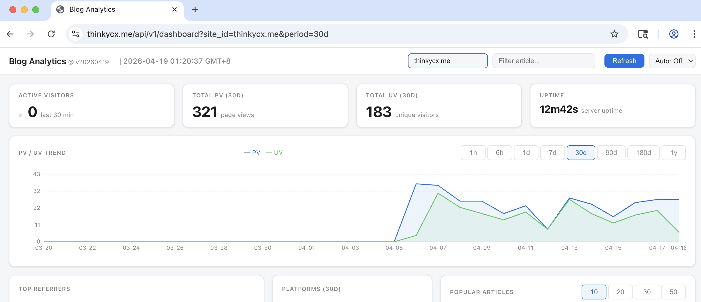
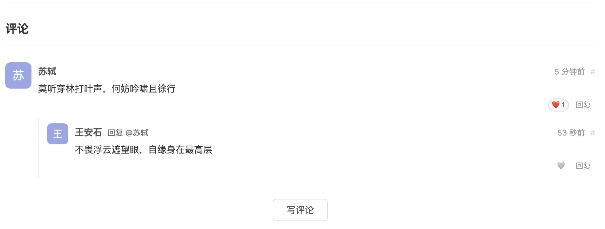
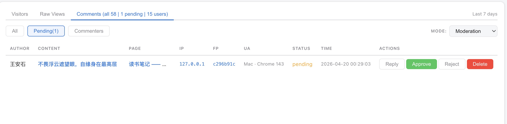

# Blog Helper

[中文文档](README_zh.md) | [Background](https://thinkycx.me/2026-04-19-blog-helper-for-static-blog.html) | [Featured in Ruan Yifeng's Weekly](https://www.ruanyifeng.com/blog/2026/04/weekly-issue-394.html)

Lightweight analytics and comment system for static blogs — PV/UV tracking, popular articles, trend charts, comment moderation, and a built-in dashboard. One instance serves multiple sites, isolated by hostname.

**Analytics Dashboard**


**Comment Section on Blog Post**


**Comment Management**


## Features

- **Page View Tracking** — PV + UV per page, browser fingerprint dedup
- **Batch Stats** — fetch counts for an article list in one request
- **Popular Articles** — ranked by PV, configurable period (7d / 30d / all), prefix include/exclude filtering
- **Analytics Dashboard** — password-protected, with trend charts, referrers, visitors, raw access logs, and comment management
- **Multi-Site** — one instance, N sites, data isolated by `site_id` (auto-detected from hostname)
- **Comment System** — email-based identity, Markdown support, emoji reactions, cookie token persistence
- **Inline Comments** — select any passage to comment on it; anchored passages get a highlighted underline, click to view/reply in a popover, deep links (`#bh-{start}-{end}`) position back to the exact text
- **Share Cards** — generate a quote card image (QR deep link included) with 5 styles (plain / quote / calendar / serene / bamboo), 5 CJK fonts (auto-hidden if the device lacks them), 5 background colors, copy image / copy link / native share
- **Page Reactions** — per-article heart button, independent of comment mode
- **Zero-Dependency SDK** — single JS file + CSS, auto-detects page type, renders stats into your theme
- **Graceful Degradation** — backend down? Blog works normally, no JS errors

## Quick Start

### 1. Run the backend

```bash
make run

# Or with custom options
go run ./cmd/server/ -addr 127.0.0.1:9001 -db ./data/blog-helper.db \
    -allowed-origins "https://your-site.com"
```

### 2. Add SDK to your blog

```html
<link rel="stylesheet" href="asset/js/blog-helper.css">
<script src="asset/js/blog-helper.js" defer></script>
```

Zero config required. The SDK auto-detects current domain, page type, and API URL.

### 3. Local development

```bash
# Terminal 1: Go backend
make run

# Terminal 2: dev server (static files + reverse proxy)
SITE_DIR=/path/to/your-blog make dev
```

Dev server on `http://localhost:4000`, proxies `/api/` to the Go backend.

## API

Full API reference: [docs/API.md](docs/API.md) — analytics, comments & reactions, dashboard endpoints, request/response examples, and the inline-comment anchor format.

## SDK

Zero config by default. Override when needed:

```html
<link rel="stylesheet" href="asset/js/blog-helper.css">
<script>
window.BlogHelperConfig = {
  apiBase: "https://your-domain.com/api/v1/analytics",
  selectors: {
    listItems: ".post-item",
    listItemLink: "a",
    postContainer: "article.post",
    postMeta: "article.post time",
    sidebarMount: "#ba-popular-mount"
  },
  features: {
    reportPV: true,
    showListPV: true,
    showListAll: false,     // UV + PV + likes per list item (overrides showListPV)
    showPostStats: true,
    showPopular: true,
    showComments: "auto",   // true | "auto" | false
    showInlineComments: true, // text-anchored comments + share cards on selections
    popularLimit: 8,
    popularPeriod: "all",   // "7d", "30d", "all"
    popularPrefix: "",      // only show slugs with this prefix
    popularExclude: "",     // comma-separated prefixes to exclude
    popularCacheTTL: 3600000  // localStorage cache TTL (ms), 0=disable
  },
  pvLabel: "Views",
  uvLabel: "Visitors",
  popularTitle: "Hot Posts"
};
</script>
<script src="asset/js/blog-helper.js" defer></script>
```

**Browser Fingerprint**: The SDK hashes lightweight browser signals (screen, canvas, timezone, etc.) via SHA-256. A cookie (`_bh_fp`) persists the hash for consistent UV counting. No user consent required — 5-10% deviation is acceptable for blog analytics.

**UV Calculation**: `COUNT(DISTINCT fingerprint)`. Visitors without a fingerprint (bots, JS disabled, privacy browsers) are counted as 1 collective "unknown" visitor. UV is always >= 1 when PV > 0.

## Dashboard

Password-protected at `/api/v1/dashboard`. Set via `-dashboard-pass` flag or `BH_DASHBOARD_PASS` env var (default: `helper`).

**Panels**: Active visitors, PV/UV summary, article likes, commenters, trend chart, popular articles, referrer domains, platforms, visitor list, raw access logs, comment management.

**Time ranges**: Trend chart supports 1h, 6h, 1d, 7d, 30d, 90d, 180d, 365d. All stat cards (PV/UV/Likes/Commenters) respect the selected period.

**Article drill-down**: Click any article in Popular to filter trend and referrers to that page.

**Comment management**: All/Pending/Commenters sub-tabs, admin reply (Markdown), runtime mode switch, UA parsed as `OS · Browser`.

## Configuration

| Flag | Env Var | Default | Description |
|------|---------|---------|-------------|
| `-addr` | `BH_ADDR` | `127.0.0.1:9001` | Listen address |
| `-db` | `BH_DB` | `./data/blog-helper.db` | SQLite database path |
| `-allowed-origins` | `BH_ALLOWED_ORIGINS` | `https://your-site.com` | CORS origins (comma-separated) |
| `-dashboard-pass` | `BH_DASHBOARD_PASS` | `helper` | Dashboard login password |
| `-comment-mode` | `BH_COMMENT_MODE` | `off` | Comment mode: `off`, `auto-approve`, `moderation` |
| `-debug` | — | `false` | Expose version in health endpoint |

## Comment System

Enable with `-comment-mode auto-approve` (or `moderation` for manual review).

**Features**: email-based identity with cookie token, threaded replies, Markdown (Write/Preview tabs), emoji reactions on comments and pages, profile editing (blog URL, bio).

**Per-site control**: SDK `showComments` option — `true` (always on), `"auto"` (detect from backend, default), `false` (disabled). Page reactions (heart) work independently regardless of comment mode.

### Inline Comments (text-anchored)

Select any passage in the article body → a menu appears (comment / copy / share). Comments posted this way carry a
content-addressed anchor (W3C-Web-Annotation-style TextQuoteSelector):

```json
{"exact": "selected text", "prefix": "up to 32 chars before", "suffix": "up to 32 chars after", "start": 190, "end": 210}
```

- Stored in the `comments.anchor` column (JSON, empty = whole-page comment; backward compatible)
- Resolution: position-first with exact-text verification, then prefix+exact+suffix search, then plain search — survives theme changes and small content edits; degrades to a quote-only comment if the passage is gone
- Highlights are painted per text node (layout-safe for any selection), passages with no comments yet get an instant dashed underline while writing
- Deep links: `page.html#bh-190-210` scrolls to the passage and flashes it (auto-expands collapsed `<details>` ancestors)

### Share Cards

The share action renders a canvas quote card: quote (paragraph-aware, grows into a long image) + post title + QR code
of the deep link + centered `@{hostname}` footer. Style/font/background options are chosen at render time and persisted
in `localStorage`. Fonts that the current device cannot render are hidden from the options instead of silently
falling back.

**Anti-bot**: Proof-of-Work (SHA-256 prefix challenge), rate limit (5 comments/IP/minute), honeypot field.

## Anti-Abuse

| Layer | Mechanism | Detail |
|-------|-----------|--------|
| Analytics | Sliding window dedup | Same fingerprint + slug within 30s |
| Analytics | Bot UA filter | Googlebot, etc. excluded |
| Comments | Proof-of-Work | SHA-256 challenge before each post |
| Comments | Rate limit | 5 comments per IP per minute |
| Comments | Honeypot | Hidden field traps bots |
| Nginx (optional) | `limit_req` per IP | Recommended: 10 req/s, burst 20 |

## Deployment

```bash
make build          # current platform
make build-linux    # linux/amd64
```

### Docker Compose (recommended)

```yaml
services:
  blog-helper:
    image: debian:bullseye-slim
    container_name: blog-helper
    volumes:
      - ./blog-helper:/app
    working_dir: /app
    command: ["./blog-helper", "-addr", "0.0.0.0:9001", "-db", "/app/data/blog-helper.db",
              "-allowed-origins", "https://site-a.com,https://site-b.com"]
    environment:
      - BH_DASHBOARD_PASS=your-password
    restart: always
```

Nginx proxies `/api/` to the backend:

```nginx
location /api/ {
    proxy_pass http://blog-helper:9001;
    proxy_set_header Host $host;
    proxy_set_header X-Real-IP $remote_addr;
    proxy_set_header X-Forwarded-For $proxy_add_x_forwarded_for;
}
```

### Standalone (systemd)

```ini
[Service]
ExecStart=/opt/blog-helper/blog-helper \
    -addr 127.0.0.1:9001 \
    -db /opt/blog-helper/data/blog-helper.db \
    -allowed-origins https://your-site.com
Environment=BH_DASHBOARD_PASS=your-password
Restart=always
```

## Project Structure

```
blog-helper/
├── cmd/server/main.go              # Entry point + graceful shutdown
├── internal/
│   ├── config/config.go            # Flags + env vars
│   ├── handler/
│   │   ├── analytics.go            # Analytics API handlers
│   │   ├── comment.go              # Comment API handlers
│   │   ├── dashboard.go            # Dashboard UI (single-page)
│   │   ├── health.go               # Health check
│   │   └── middleware.go           # CORS, logging, recovery, auth
│   ├── model/
│   │   ├── analytics.go            # Analytics domain types
│   │   └── comment.go             # Comment domain types
│   ├── store/
│   │   ├── store.go                # Repository interface
│   │   └── sqlite.go              # SQLite implementation
│   └── service/
│       ├── analytics.go            # Dedup, bot filter, rate limit
│       └── comment.go             # Comment business logic
├── sdk/
│   ├── blog-helper.js              # Frontend SDK
│   ├── blog-helper.css             # SDK styles
│   └── lib/marked.min.js           # Markdown parser (local)
├── scripts/dev-server.py           # Dev server (static + proxy)
└── Makefile
```

## Tech Stack

- **Backend**: Go — stdlib `net/http`, no framework
- **Database**: SQLite via [`modernc.org/sqlite`](https://pkg.go.dev/modernc.org/sqlite) (pure Go, no CGO)
- **Frontend**: Vanilla JS, zero dependencies
- **Deploy**: Docker Compose / systemd + nginx

## License

MIT
